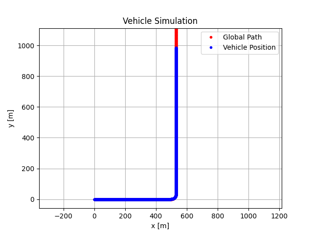
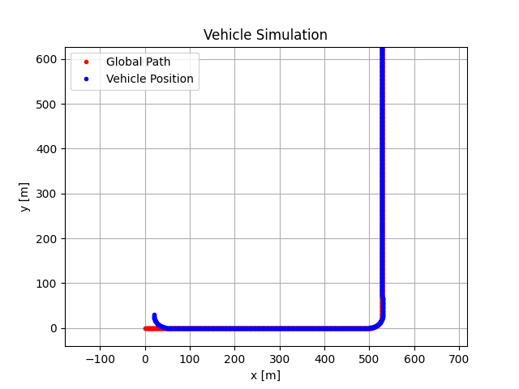

# VehicleProject
## Introduction
This project is a simulation of vehicle kinematics model (Bicycle Model). The vehicle gets an initial condition and a constant velocity and uses a pure pursuit algorithm to follow a path, while steering dynamics is simulated (as 2nd order system + delay). You can find more details in docs/Assignment.pdf.

## Instructions
0. Make sure you have a gcc compiler and the basic python3 packages - Numpy and Matplotlib.
1. Build the program with `make all` command.
2. Run the program with `./VehicleProject -x0 <x0> -y0 <y0> -psi <psi> -v <v>`. `x0, y0, psi` is the initial pose of the vehicle and `v` is a constant velocity of the vehicle. The simulation takes some time, please be patient.
3. The program generates 2 txt files: **a)** pathPoints.txt is the reference path for the vehicle. **b)** VehiclePosition.txt is the vehicle positions during simulation.
4. Run the python script - plotResults.py with the command `python3 plotResults.py`.

## Examples
1. Simulation result's plot of `./VehicleProject -x0 0 -y0 0 -psi 0 -v 5`:

2. Simulation result's plot of `./VehicleProject -x0 20 -y0 30 -psi -1.5 -v 15`:

